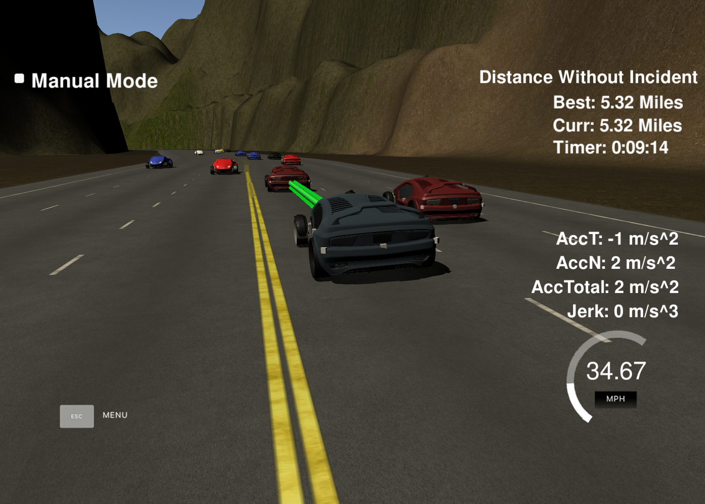

# CarND-Path-Planning-Project
Self-Driving Car Engineer Nanodegree Program
   
## Goals
In this project your goal is to safely navigate around a virtual highway with other traffic that is driving +-10 MPH of the 50 MPH speed limit. You will be provided the car's localization and sensor fusion data, there is also a sparse map list of waypoints around the highway. The car should try to go as close as possible to the 50 MPH speed limit, which means passing slower traffic when possible, note that other cars will try to change lanes too. The car should avoid hitting other cars at all cost as well as driving inside of the marked road lanes at all times, unless going from one lane to another. The car should be able to make one complete loop around the 6946m highway. Since the car is trying to go 50 MPH, it should take a little over 5 minutes to complete 1 loop. Also the car should not experience total acceleration over 10 m/s^2 and jerk that is greater than 10 m/s^3.

## Build
### Dependencies

* cmake >= 3.5
 * All OSes: [click here for installation instructions](https://cmake.org/install/)
* make >= 4.1
  * Linux: make is installed by default on most Linux distros
  * Mac: [install Xcode command line tools to get make](https://developer.apple.com/xcode/features/)
  * Windows: [Click here for installation instructions](http://gnuwin32.sourceforge.net/packages/make.htm)
* gcc/g++ >= 5.4
  * Linux: gcc / g++ is installed by default on most Linux distros
  * Mac: same deal as make - [install Xcode command line tools](https://developer.apple.com/xcode/features/)
  * Windows: recommend using [MinGW](http://www.mingw.org/)
* [uWebSockets](https://github.com/uWebSockets/uWebSockets)
  * Run either `install-mac.sh` or `install-ubuntu.sh`.
  * If you install from source, checkout to commit `e94b6e1`, i.e.
    ```
    git clone https://github.com/uWebSockets/uWebSockets 
    cd uWebSockets
    git checkout e94b6e1
    ```
* Simulator: Term 3 v1.2 <br>https://github.com/udacity/self-driving-car-sim/releases/tag/T3_v1.2

### Build Instructions

1. Change directory: `cd p11_pp/build`
3. Build it: `cmake .. && make`
4. Run it: `./path_planning`.

## Valid Trajectories
### The car is able to drive at least 4.32 miles without incident
Attached screen shows the car completing the 4.32 miles loop without incident.



### The car drives according to the speed limit
The car maintains speed withing the limit of 50 MPH. Also tries to drive close 50 MPH unless slow moving vehicles are causing it to slow down.

```c++            
    if (too_close) {
      ref_vel -= 0.224;  // deccelerate 5m/sec2
    } else if (ref_vel < 49.5) {
      ref_vel += 0.224; // accelerate 5m/sec2
    }
```

### Max Acceleration and Jerk are not Exceeded
The car's maximum speed is ensured to not to exceed 50 MPH and also jerks are avoided by accelerating and deccelating at 5m/sec<sup>2</sup>. See the code snippet above.

### Car does not have collisions
The car monitors vehicles infront on the current and intended adjacent lanes to avoid collision.

```c++
    // find ref vel
    for (int i=0; i < sensor_fusion.size();i++) {
      // car in our lane
      float d = sensor_fusion[i][6]; // ith car, 7th param(6) = d
      if (d < (2 + 4*lane + 2) && d > (2 + 4*lane - 2)) {
        double vx = sensor_fusion[i][3];
        double vy = sensor_fusion[i][4];
        double check_speed = sqrt(vx*vx+ vy*vy);
        double check_car_s = sensor_fusion[i][5]; // 6th param s val
        
        check_car_s += ((double) prev_size * 0.02 *check_speed); 
        //check s values greater than mine and s gap
        if ((check_car_s > car_s) && ((check_car_s - car_s) < 30)) {
          // lower ref vel so that we do not crash
          //ref_vel = 29.5; // mph
          too_close = true;
          
          if (lane > 0){
            lane = 0;
          }
          
        }
      }
    }            
```

### The car stays in its lane, except for the time between changing lanes
Waypoints are calculated on in Frenet co-ordinates using center of lane co-ordinates unless changing lanes, then converting Frenet co-ordinates to car reference co-ordinates. This ensure car stayes in its lane unless changing the lanes.

```c++
  // add 3 more forward way points. Use Frenet.
  vector<double> next_wp = getXY(car_s + 30, (2+4*lane), map_waypoints_s, map_waypoints_x, map_waypoints_y);
  ptsx.push_back(next_wp[0]);
  ptsy.push_back(next_wp[1]);
  
  vector<double> next_wp2 = getXY(car_s + 60, (2+4*lane), map_waypoints_s, map_waypoints_x, map_waypoints_y);
  ptsx.push_back(next_wp2[0]);
  ptsy.push_back(next_wp2[1]);
  
  vector<double> next_wp3 = getXY(car_s + 90, (2+4*lane), map_waypoints_s, map_waypoints_x, map_waypoints_y);
  ptsx.push_back(next_wp3[0]);
  ptsy.push_back(next_wp3[1]);
  
  // Shift the points to car reference 
  for (int i = 0; i < ptsx.size(); i++){
    double shift_x = ptsx[i] - ref_x;
    double shift_y = ptsy[i] - ref_y;
    
    ptsx[i] = (shift_x * cos(0 - ref_yaw) - shift_y * sin(0- ref_yaw));
    ptsy[i] = (shift_x * sin(0 - ref_yaw) + shift_y * cos(0- ref_yaw));
  }
  
  // create spline
  tk::spline s;
  s.set_points(ptsx, ptsy);
```

### The car is able to change lanes
Car is able to change the lane smoothly as target lane Frenet co-ordinates are calculates and polynomial trajectory is generated using Spline function. See the code snipptes above.


## Reflection
Reflection


