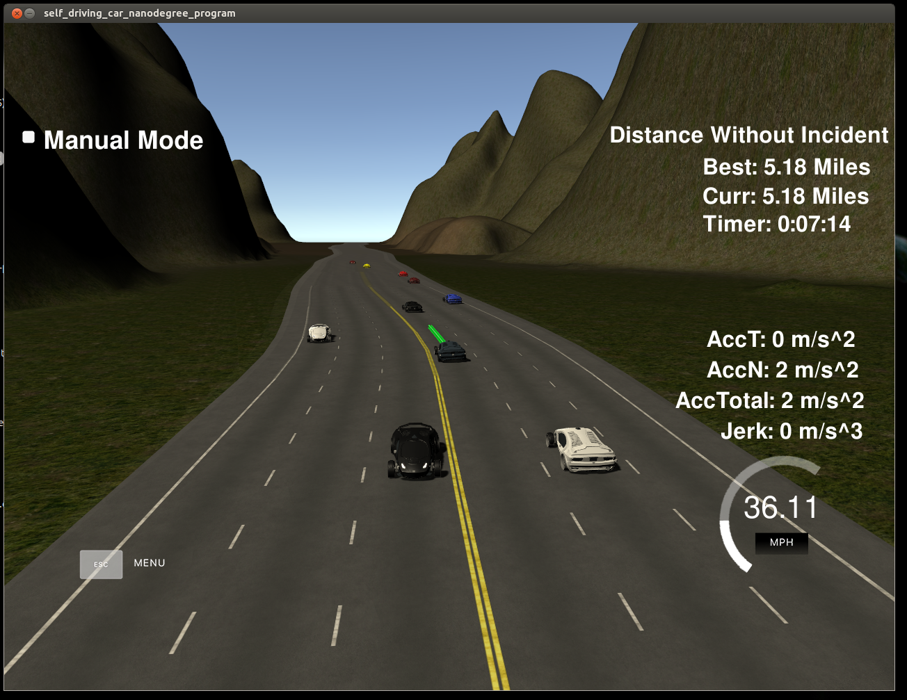
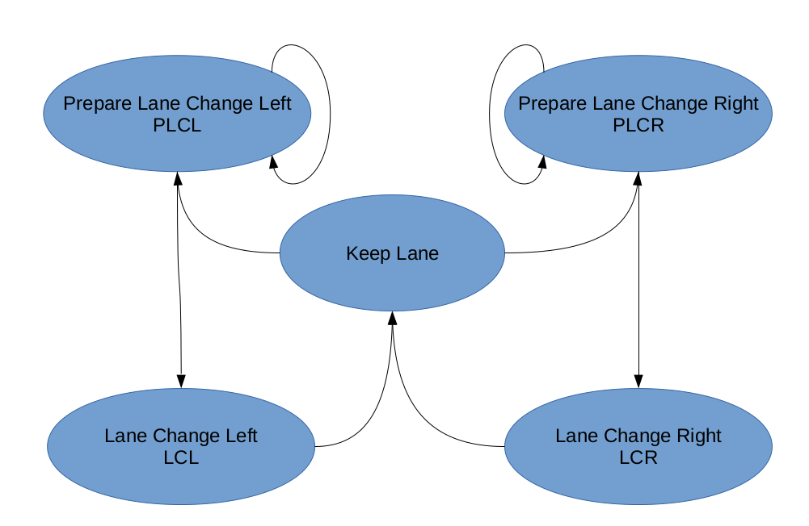

# CarND-Path-Planning-Project
Self-Driving Car Engineer Nanodegree Program
   
## Goals
In this project goal is to safely navigate around a virtual highway with other traffic that is driving +-10 MPH of the 50 MPH speed limit. You will be provided the car's localization and sensor fusion data, there is also a sparse map list of waypoints around the highway. The car should try to go as close as possible to the 50 MPH speed limit, which means passing slower traffic when possible, note that other cars will try to change lanes too. The car should avoid hitting other cars at all cost as well as driving inside of the marked road lanes at all times, unless going from one lane to another. The car should be able to make one complete loop around the 6946m highway. Since the car is trying to go 50 MPH, it should take a little over 5 minutes to complete 1 loop. Also the car should not experience total acceleration over 10 m/s^2 and jerk that is greater than 10 m/s^3.

## Build
### Dependencies

* cmake >= 3.5
 * All OSes: [click here for installation instructions](https://cmake.org/install/)
* make >= 4.1
  * Linux: make is installed by default on most Linux distros
  * Mac: [install Xcode command line tools to get make](https://developer.apple.com/xcode/features/)
  * Windows: [Click here for installation instructions](http://gnuwin32.sourceforge.net/packages/make.htm)
* gcc/g++ >= 5.4
  * Linux: gcc / g++ is installed by default on most Linux distros
  * Mac: same deal as make - [install Xcode command line tools](https://developer.apple.com/xcode/features/)
  * Windows: recommend using [MinGW](http://www.mingw.org/)
* [uWebSockets](https://github.com/uWebSockets/uWebSockets)
  * Run either `install-mac.sh` or `install-ubuntu.sh`.
  * If you install from source, checkout to commit `e94b6e1`, i.e.
    ```
    git clone https://github.com/uWebSockets/uWebSockets 
    cd uWebSockets
    git checkout e94b6e1
    ```
* Simulator: Term 3 v1.2 <br>https://github.com/udacity/self-driving-car-sim/releases/tag/T3_v1.2

### Build Instructions

1. Change directory: `cd p11_pp/build`
3. Build: `cmake .. && make`
4. Run: `./path_planning`.

## Valid Trajectories
### The car is able to drive at least 4.32 miles without incident
Attached screen shows the car completing the 4.32 miles loop without incident.



### The car drives according to the speed limit
The car maintains speed withing the limit of 50 MPH. Also tries to drive close 50 MPH unless slow moving vehicles are causing it to slow down.

```c++            
    static constexpr double SPEED_LIMIT = 22; //m/sec,  45 miles/hour * 0.447 ==  20m/sec ;
    static constexpr double MAX_ACCEL = 0.08; //m per sim cycle,i.e 1/50th of sec. 0.09m/0.02 sec = 10m/sec/sec 
    static constexpr double MAX_S = 6945.554;  // 4.32 miles      
    static const int PREF_BUFFER = 30; //Buffer from other vehicles in current and target lanes.

```

### Max Acceleration and Jerk are not Exceeded
The car's maximum speed is ensured to not to exceed 50 MPH and also jerks are avoided by accelerating and deccelating at 5m/sec<sup>2</sup>. See the code snippet above.

### Car does not have collisions
The car monitors vehicles close infront and behind in current lane as well as target lanes before changing the lanes. 

The get_traffic_kinematics member function in Road class gather information related to other vehicles in current and target lanes. It identifies the distances closest front and back vehicles in each lane and their velocities. 


```c++
vector<vector<double>> Road::get_traffic_kinematics(map<int, Vehicle> vehicles, Vehicle ego); 
```


### The car stays in its lane, except for the time between changing lanes
Waypoints are calculated on in Frenet co-ordinates using center of lane co-ordinates unless changing lanes, then converting Frenet co-ordinates to car reference co-ordinates. This ensure car stayes in its lane unless changing the lanes.

```c++
void Road::update(const json &jsn) 
{
...
  // Add 3 more forward way points. Use Frenet.
  for (auto& offset: {30, 60, 90}) {
    vector<double> next_wp = getXY(car_s + offset, (2 + 4 * lane), this->_wp_s, this->_wp_x, this->_wp_y);
    ptsx.push_back(next_wp[0]);
    ptsy.push_back(next_wp[1]);
  }

  // Shift the points to car reference
  for (int i = 0; i < ptsx.size(); i++)
  {
    double shift_x = ptsx[i] - car_x_calc;
    double shift_y = ptsy[i] - car_y_calc;

    ptsx[i] = (shift_x * cos(0 - ref_yaw) - shift_y * sin(0 - ref_yaw));
    ptsy[i] = (shift_x * sin(0 - ref_yaw) + shift_y * cos(0 - ref_yaw));
  }
...
}
```

### The car is able to change lanes
Car is able to change the lane smoothly as target lane Frenet co-ordinates are calculated and smooth polynomial trajectory is generated using Spline function. See the code snipptes above and below.

The Road::update member function uses spline library to create smooth trajectories with accepteble jerks levels. 

```c++
void Road::update(const json &jsn) 
{
...
    double N = (target_dist / (0.02 * ref_vel)); 
    double delta = (target_x) / N;
    x_ref += delta;    
    y_ref = spln(x_ref); 

    //rotate back to normal/global co-ordinates
    double x_point = (x_ref * cos(ref_yaw) - y_ref * sin(ref_yaw));
    double y_point = (x_ref * sin(ref_yaw) + y_ref * cos(ref_yaw));
    x_point += car_x_calc;
    y_point += car_y_calc;

    next_x_vals.push_back(x_point);
    next_y_vals.push_back(y_point);
...
}
```
Car uses Finite State Machine to keep track of and to change optimal future state. It uses Cost functions to decide among valid future states and trajectories.

```c++
TrajectoryAction Vehicle::choose_next_state(map<int, TrajectoryAction> &predictions, vector<vector<double>> &traffic_info, int horizon) {
   ...
    for (vector<string>::iterator it = states.begin(); it != states.end(); ++it) {
        TrajectoryAction trajectory = generate_trajectory(*it, predictions, traffic_info);
        if (&trajectory != &NULL_TRAJECTORY_ACTION) {
            cost = calculate_cost(*this, predictions, trajectory);
            cout << "State:" << *it << " cost=" << cost << "\n" ;
            costs.push_back(cost);
            final_trajectories.push_back(trajectory);
        } else {
            // std::cout << "NULL traj action for state:" << *it << std::endl;
        }
    }

    vector<float>::iterator best_cost = min_element(begin(costs), end(costs));
    int best_idx = distance(begin(costs), best_cost);

    return final_trajectories[best_idx];
}
```

Below diagram depicts the states and transistions of Finite State Machine used in this project.



## Reflection
This project exposed me to Path Planning steps involved, like predicting behaivior of other vehicles, planning and creating trajectories and deciding optimal trajectory and patch based using Cost functions.

Once code infrasture is in place, most of the effort is spent in tuning parameters so as to minimize jerks, change lanes smoothly without colliding, and accelerate and decelerate as appropriate to drive at the optimal speed.

## Video
Below is the link to the video showing car completing the track w/o collsions and jerks.

[Video](https://github.com/gmpatil/sdcnd/blob/master/term3/p11_pp/res/pp11_path_planning.m4v "Car completing the track")


